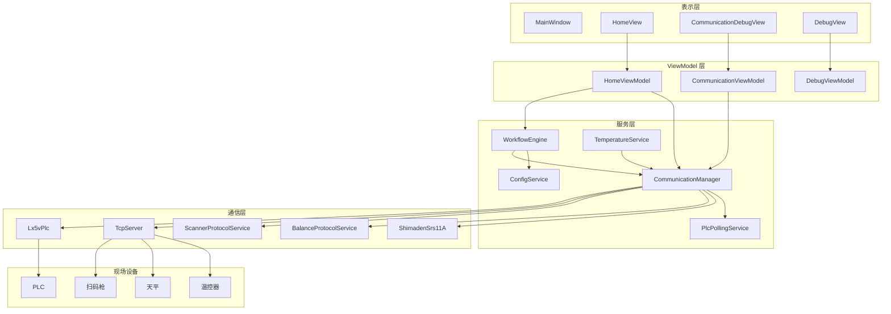

# DMSJ Blood Alcohol

一个基于 `C#`、`.NET 8` 和 `WPF` 的血醇检测工业上位机项目。  
项目面向多设备联动场景，负责流程控制、参数下发、PLC 通信、扫码枪/天平/温控器接入、运行日志和现场诊断。

> 这个仓库更接近真实产线调试中的工业上位机，而不是单纯的界面演示项目。  
> 核心重点在于多工位流程协同、设备通信稳定性和异常可定位能力。

---

## 1. 项目概览

### 1.1 项目定位

本项目是一个 `net8.0-windows` 目标框架下的桌面上位机程序，主要服务于血醇检测流程中的设备联动与工艺执行。

上位机主要负责以下工作：

- 启动时加载通信配置并自动连接设备
- 向 PLC 下发初始化参数、启动信号、停止信号和急停信号
- 按流程驱动扫码、清零、称重、重量转 Z、结果确认
- 提供通信配置页和调试页，支持现场联机、在线测试和日志诊断
- 将运行日志和单管轨迹落盘，便于现场追溯

### 1.2 主要设备

- PLC
- 扫码枪
- 天平
- 温控器

### 1.3 主要通信方式

- `RS485`
- `Modbus RTU`
- `TCP Server`

### 1.4 技术栈

- `C#`
- `.NET 8`
- `WPF`
- `MVVM`
- `NModbus`
- `System.IO.Ports`

---

## 2. 项目特点

- 支持 `PLC + 扫码枪 + 天平 + 温控器` 多设备联动
- 首页负责流程控制、运行状态、日志和料架状态展示
- 通信配置页支持 `RS485/TCP` 联机、端口映射配置和在线测试
- 使用 `WorkflowEngine` 作为主流程状态机，按 PLC 允许位和确认位推进步骤
- 使用 `CommunicationManager` 统一管理 PLC、TCP、协议对象和通信状态
- 支持共享 TCP 网关场景下的设备身份映射、回包过滤、超时控制和残留帧清理
- 支持重量转 Z 标定和体积联动显示
- 支持运行日志和轨迹 CSV 落盘，便于现场排障和复盘

---

## 3. 系统架构

### 3.1 分层说明

项目整体采用：

`WPF 表示层 + ViewModel 交互层 + Services 业务层 + Communication/Protocols 通信层 + Config/Logs 持久化层`

可以简单理解为四层职责：

1. 界面层  
负责页面展示、按钮交互、参数输入和在线测试入口。

2. 业务层  
负责初始化、开始、停止、急停、流程状态机和后台监控任务。

3. 通信层  
负责 PLC、串口、TCP、扫码枪、天平、温控器的收发与协议处理。

4. 配置与日志层  
负责 JSON 配置读写、运行日志和轨迹文件落盘。

### 3.2 架构图



### 3.3 核心模块

| 模块 | 文件 | 作用 |
|---|---|---|
| 启动入口 | `App.xaml.cs` | 注册全局异常、加载配置、自动连接设备、打开主窗口 |
| 首页控制中心 | `ViewModels/Home/HomeViewModel.cs` | 初始化、开始、停止、急停、日志、料架状态、模式联动 |
| 流程状态机 | `Services/WorkflowEngine.cs` | 扫码、清零、称重、重量转 Z、等待确认位、流程日志 |
| 通信总入口 | `Services/CommunicationManager.cs` | 统一持有 PLC、TCP、协议对象和通信配置 |
| PLC 轮询缓存 | `Services/PlcPollingService.cs` | 后台轮询常用点位并提供缓存快照 |
| 温控服务 | `Services/TemperatureService.cs` | 温度读取和温控命令发送 |
| 通信配置页 | `ViewModels/CommunicationViewModel.cs` | RS485/TCP 连接、设备映射、在线测试和日志输出 |
| TCP 服务端 | `Communication/Tcp/TcpServer.cs` | 接收设备连接、维护设备身份映射、按设备收发数据 |

---

## 4. 页面结构

### 4.1 主页面签

项目当前主窗口主要包含以下页面：

- `HomeView`
  - 首页流程控制中心
  - 展示日志、料架状态、检测状态、参数摘要
- `CommunicationDebugView`
  - 通信配置页
  - 提供 RS485/TCP 配置、在线连接和设备测试入口
- `DebugView`
  - 调试页入口
  - 包含轴调试、点位监控、故障调试、坐标调试、重量转 Z 标定、参数配置等页面

### 4.2 调试页子模块

- `AxisDebugView`
- `PointMonitorView`
- `FaultDebugView`
- `CoordinateDebugView`
- `WeightToZDebugView`
- `ParameterConfigView`
- `CylinderControlView`
- `PointPositionControlView`

---

## 5. 运行主线

### 5.1 启动流程

程序启动时会执行以下动作：

1. 注册全局异常处理
2. 加载通信配置
3. 自动连接 `RS485` 和 `TCP`
4. 打开主窗口
5. 首页初始化后台监控任务

对应入口：

- `App.OnStartup`
- `CommunicationManager.LoadSettings()`
- `CommunicationManager.AutoConnect()`

### 5.2 初始化流程

操作员点击首页“初始化”后：

1. 从工艺参数配置读取初始化参数
2. 写入 PLC 指定寄存器
3. 回读并校验写入结果
4. 下发 `M13` 初始化命令
5. 轮询 `M14` 判断初始化完成

### 5.3 开始检测流程

点击首页“开始”后：

1. 校验前置条件
   - 报警位正常
   - 自动模式已启用
   - 初始化已完成
2. 发送 `M5` 开始脉冲
3. 启动 `WorkflowEngine`
4. 流程按 PLC 允许位上升沿驱动扫码、清零、称重、重量转 Z、步骤确认
5. 首页实时刷新日志、料架颜色和体积显示

### 5.4 停止与急停

- 正常停止：停止流程并发送 `M900`
- 急停：立即停止流程，并发送 `M3` 与 `M900`

---

## 6. WorkflowEngine 主流程说明

`WorkflowEngine` 是当前项目最核心的业务引擎之一。

它的职责不是单纯轮询 PLC，而是把多步骤流程整理成可观察、可追踪的状态机。

### 6.1 运行机制

- `Start()` 启动后台循环
- 内部通过 `MonitorEventsLoopAsync()` 周期轮询
- 检测各流程触发位的上升沿
- 分发到扫码处理、称重处理等具体方法

### 6.2 关键步骤

典型步骤包括：

- 扫码成功
- 等待扫码确认位
- 天平清零
- 顶空瓶放置称重
- 采血管放置称重
- 采血管吸液后称重
- 顶空瓶加血液后称重
- 顶空瓶加叔丁醇后称重
- 重量转 Z 下发
- 等待 PLC OK 确认

### 6.3 与扫码和天平的交互特点

- 扫码流程会过滤共享 TCP 中可能混入的非扫码回包
- 称重流程会过滤无效回包并解析重量
- 每次读取重量前会先执行天平清零命令
- 收发链路使用全局 `TcpReceiveLock` 保护，避免共享 TCP 通道串包

---

## 7. 通信设计说明

### 7.1 RS485 与 PLC

PLC 通信链路主要由以下模块组成：

- `Rs485Helper`
- `Lx5vPlc`
- `PlcPollingService`

职责划分：

- `Rs485Helper` 负责串口打开、关闭和基础收发
- `Lx5vPlc` 负责 Modbus RTU 读写封装
- `PlcPollingService` 负责常用点位后台轮询和缓存

### 7.2 TCP 与设备映射

TCP 设备接入主要由以下模块组成：

- `TcpServer`
- `ScannerProtocolService`
- `BalanceProtocolService`
- `ShimadenSrs11A`

当前项目不是按“界面点哪个端口就发给哪个连接”这种方式工作，而是通过 `DeviceKey` 管理逻辑设备身份。

这套机制的目的，是让扫码枪、天平、温控器等设备在共享 TCP 通道或同类连接场景下，仍然能按逻辑身份正确收发。

### 7.3 默认 TCP 设备映射

当前默认配置中预置了以下设备类型：

| DeviceType | DeviceKey | 端口标识 |
|---|---|---|
| 温控 | 温控 | `9001` |
| 扫码枪 | 扫码枪 | `9002` |
| 天平 | 天平 | `9003` |
| 待定 | 待定 | `9004` |

说明：

- `Port` 在当前设计里更接近“端口标识”而不等于真实客户端源端口
- `DeviceKey` 是业务层使用的逻辑设备身份
- `ClientIp` 可以作为额外识别条件

### 7.4 在线测试与诊断

通信配置页支持以下场景：

- 测试 PLC 通信
- 测试扫码枪
- 测试天平
- 测试温控器
- 查看发送、接收、过滤、超时和失败日志

这部分设计的目标，是让现场问题能在通信页单独验证，而不是必须进入完整主流程才能判断设备是否正常。

---

## 8. 配置说明

### 8.1 配置目录

项目通过 `Config` 目录保存配置，配置对象主要包括：

- `CommunicationSettings`
- `ProcessParameterConfig`
- `WorkflowSignalConfig`
- `WeightToZCalibrationConfig`
- `AxisDebugAddressConfig`
- `HomeExportPathConfig`
- `HomeLogBatchCounterConfig`

说明：

- 当前仓库中已包含部分配置文件
- 其他配置文件会在运行和保存配置过程中生成或更新

### 8.2 通信配置

通信相关配置主要包括：

- `ComPort`
- `BaudRate`
- `PlcSlaveAddress`
- `TcpPort`
- `TcpIP`
- `TcpDevices`

推荐联调前优先检查：

1. 串口号是否正确
2. 波特率是否与 PLC 保持一致
3. PLC 站号是否一致
4. TCP 监听地址和监听端口是否正确
5. 设备映射里的 `DeviceType / DeviceKey / ClientIp / 端口标识` 是否匹配现场设备

### 8.3 工艺与流程配置

流程相关配置通常用于：

- 初始化参数下发
- 流程触发位和确认位映射
- 重量转 Z 标定
- 页面参数和调试地址管理

如果现场流程有变动，通常优先改配置，而不是直接改代码。

---

## 9. 日志与持久化

### 9.1 日志类型

项目日志主要包括：

- 首页运行日志
- 流程状态机日志
- 通信日志
- 单管轨迹 CSV

### 9.2 日志价值

日志不仅用于报错提示，更重要的是用于还原现场执行链路，例如：

- 什么时候发送了命令
- 什么时候收到回包
- 回包是否被过滤
- 哪一步超时
- 哪一个工位或步骤确认失败

这类信息对工业现场排障非常关键。

---

## 10. 目录结构

```text
Blood Alcohol
├─ Communication/           通信实现
├─ Config/                  配置文件目录
├─ docs/                    架构说明和流程文档
├─ Helpers/                 通用辅助类
├─ Logs/                    日志落盘目录
├─ Models/                  配置模型和数据模型
├─ Protocols/               设备协议封装
├─ Resources/               图标和资源文件
├─ Services/                核心业务服务
├─ Styles/                  样式资源
├─ ViewModels/              视图模型
├─ Views/                   页面与控件
├─ App.xaml.cs              应用启动入口
├─ MainWindow.xaml          主窗口
└─ DMSJ_Blood Alcohol.csproj
```

---

## 11. 开发环境要求

### 11.1 基础环境

- Windows
- .NET 8 SDK
- Visual Studio 2022 或更高版本

### 11.2 NuGet 依赖

当前项目主要依赖：

- `NModbus`
- `System.IO.Ports`

如需命令行构建，可在项目根目录执行：

```powershell
dotnet build "DMSJ_Blood Alcohol.csproj" -v:minimal
```

---

## 12. 使用说明

### 12.1 首次打开项目

1. 使用 Visual Studio 打开 `Blood Alcohol.sln`
2. 确认目标框架为 `.NET 8`
3. 还原 NuGet 包
4. 编译并运行程序

### 12.2 首次联机建议顺序

建议按下面顺序联调：

1. 打开通信配置页
2. 配置 `RS485` 串口参数
3. 配置 `TCP` 监听参数和设备映射
4. 连接 PLC
5. 启动 TCP 服务等待设备上线
6. 分别测试扫码枪、天平、温控器
7. 确认日志中有明确发送和接收记录
8. 再回到首页执行初始化和开始流程

### 12.3 日常运行顺序

推荐操作顺序：

1. 启动软件
2. 确认 PLC 和 TCP 设备在线
3. 进入首页执行初始化
4. 等待初始化完成
5. 点击开始
6. 观察流程日志、料架状态和体积显示
7. 需要结束时点击停止
8. 异常情况下使用急停

### 12.4 调试建议

如果现场出现“设备在线但流程不正常”的问题，建议按以下顺序排查：

1. 先看通信配置页在线测试是否通过
2. 再看首页或流程日志卡在哪一步
3. 再区分是 PLC 允许位没到、TCP 没回包、回包被过滤，还是业务确认位没到

---

## 13. 常见问题

### 13.1 软件能启动，但设备不在线

优先检查：

- 串口号
- 波特率
- PLC 站号
- TCP 监听地址和监听端口
- 设备是否已主动连接到上位机
- 防火墙是否拦截监听端口

### 13.2 调试工具能收到数据，但软件收不到

优先检查：

- TCP 设备映射是否正确
- `DeviceKey` 是否配置正确
- 软件是否读到了回包但被过滤掉
- 是否存在共享 TCP 场景下的残留帧干扰

### 13.3 称重数据偶发不对

优先检查：

- 天平是否已稳定
- 称重前是否已清零
- 是否有旧回包残留
- 当前回包是否通过协议校验

### 13.4 构建时报输出文件被占用

如果 `dotnet build` 报类似 `MSB3026`、`MSB3027`、`MSB3021`，通常说明已有运行中的程序占用了输出文件。

建议先关闭：

- 正在运行的 `DMSJ_Blood Alcohol.exe`
- 可能占用构建输出的调试实例

---

## 14. 文档入口

如果需要更详细的内部说明，可继续查看：

- [Blood Alcohol 软件架构](docs/Blood%20Alcohol%20软件架构.md)
- [BloodAlcohol 运行流程图](docs/BloodAlcohol%20运行流程图.md)
- [D寄存器位宽整理](docs/D寄存器位宽整理.md)

---

## 15. 后续可优化方向

- 在 README 中补充页面截图和通信配置页截图
- 增加更清晰的架构图导出图片
- 补充配置文件示例和联调截图
- 进一步整理提交信息和版本记录，提升 GitHub 首页观感

---

## 16. 说明

本项目包含较强的现场设备依赖。  
如果没有对应硬件环境，仍然可以查看界面、结构、配置和代码实现，但完整流程验证需要配合 PLC、扫码枪、天平和温控器联机完成。
