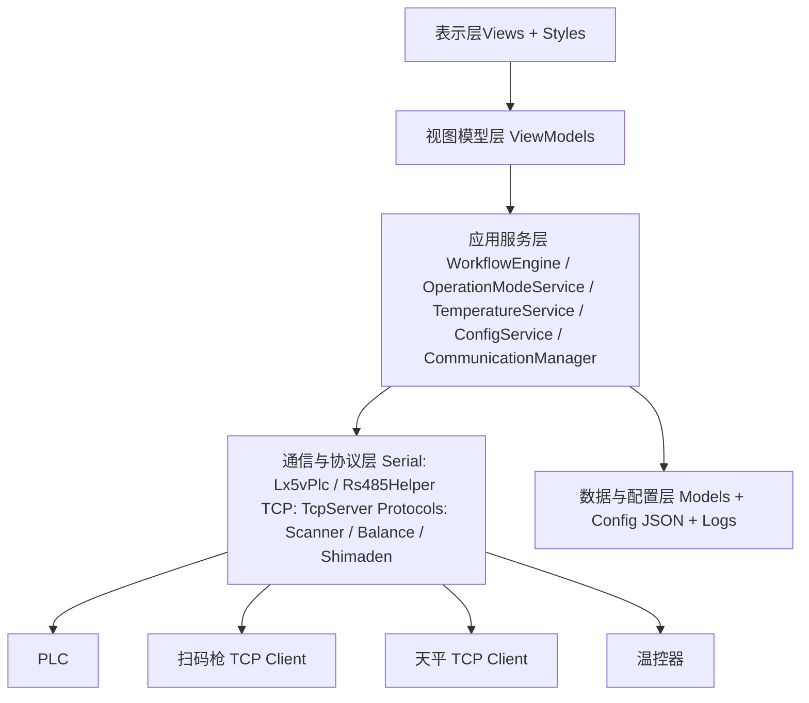

# Blood Alcohol 软件架构图

## 1. 架构总览

Blood Alcohol 上位机采用 **WPF + MVVM + 服务层** 架构，核心目标是将界面交互、流程编排、设备通信、参数配置解耦。

- 表示层：`Views/*`、`Styles/*`
- 视图模型层：`ViewModels/*`
- 业务服务层：`Services/*`
- 通信与协议层：`Communication/*`、`Protocols/*`
- 数据与配置层：`Models/*`、`Config/*.json`

## 2. 分层架构图

## 3. 模块职责

### 3.1 表示层（WPF）

- `MainWindow.xaml`：主容器与导航承载
- `Views/HomeView.xaml`：主页流程界面
- `Views/DebugView.xaml`：调试页入口
- `Views/ParameterConfigView.xaml`：参数配置界面

### 3.2 视图模型层（ViewModels）

- `HomeViewModel.cs`：主页核心状态、PLC 点位联动、工序按钮命令
- `ParameterConfigViewModel.cs`：参数读取、编辑、保存、下发 PLC
- `DebugViewModel.cs` 及各子 ViewModel：设备调试、点位监控、坐标调试

### 3.3 应用服务层（Services）

- `WorkflowEngine.cs`：工艺步骤编排与流程执行
- `OperationModeService.cs`：模式切换与流程状态协同
- `CommunicationManager.cs`：统一通信入口与设备会话管理
- `PlcPollingService.cs`：PLC 点位轮询与缓存
- `TemperatureService.cs`：温控相关采集与控制
- `ConfigService.cs`：JSON 配置读写
- `AppLogHub.cs`：日志聚合与输出

### 3.4 通信与协议层

- `Communication/Serial/Lx5vPlc.cs`：PLC 通信封装
- `Communication/Serial/Rs485Helper .cs`：串口辅助
- `Communication/Tcp/TcpServer.cs`：TCP 服务端
- `Protocols/ScannerProtocolService.cs`：扫码协议
- `Protocols/BalanceProtocolService.cs`：天平协议
- `Protocols/ShimadenSrs11A.cs`：温控器协议

### 3.5 数据与配置层

- `Models/ProcessParameterConfig.cs`：工艺参数模型
- `Models/WeightToZCalibrationConfig.cs`：重量到体积换算系数模型
- `Models/WorkflowSignalConfig.cs`：流程信号映射模型
- `Config/*.json`：可配置参数、地址映射
- `Logs/`：运行日志

## 4. 关键数据流

1. 界面操作触发 ViewModel 命令
2. ViewModel 调用 Service 执行流程或参数更新
3. Service 通过 Communication/Protocols 与 PLC、扫码枪、天平、温控器交互
4. 返回结果写回 ViewModel，刷新 UI
5. 参数变更通过 `ConfigService` 落盘到 JSON，并在初始化时重新下发 PLC

