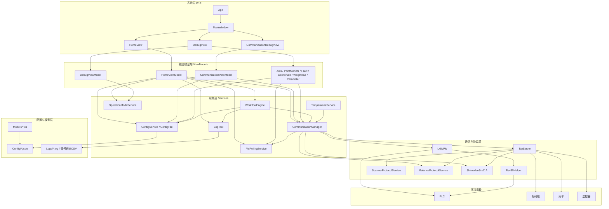
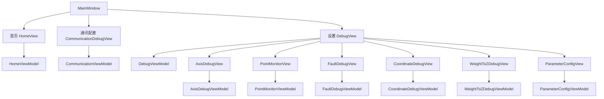
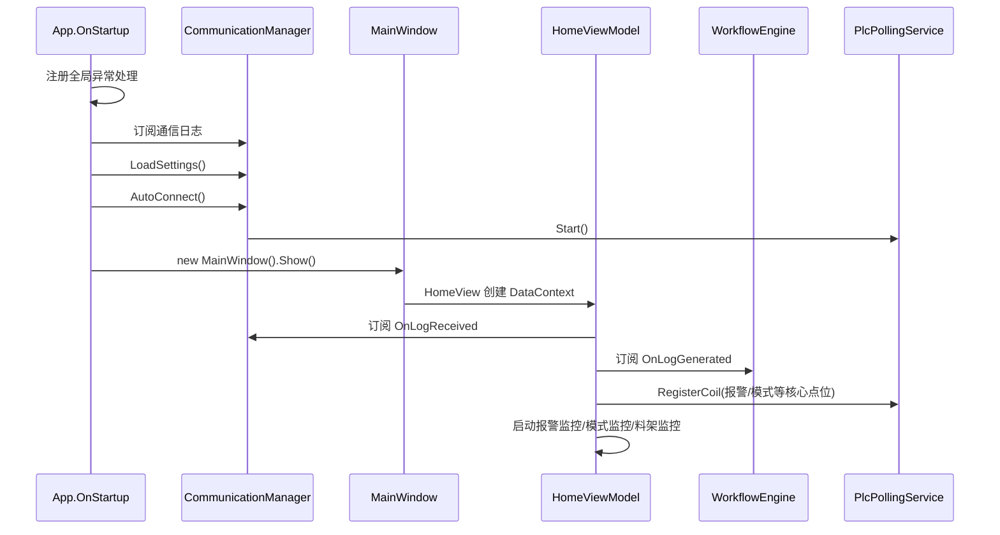
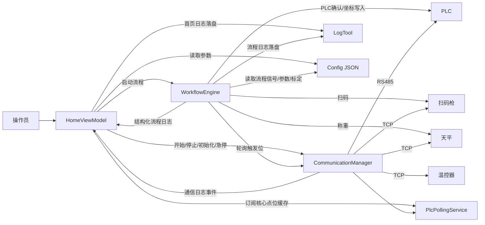
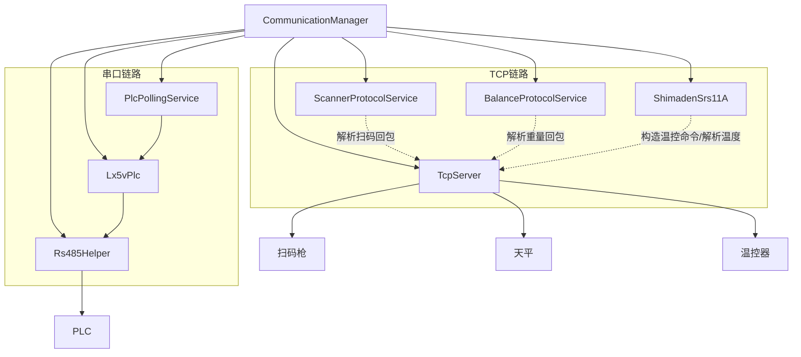
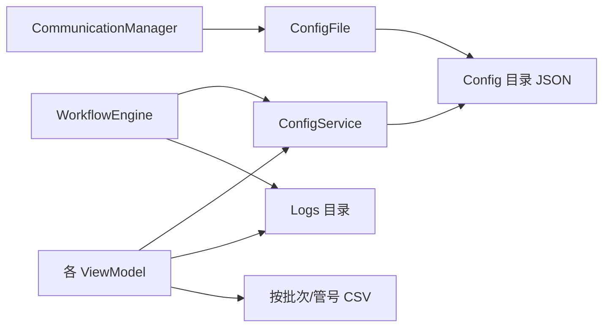

# Blood Alcohol 软件架构图(如需看图需下载Typora)

## 1. 架构定位

当前项目是一个基于 `net8.0-windows` 的 **WPF 上位机**  
整体采用 **WPF + MVVM + 服务层 + 设备通信层 + JSON 配置/日志落盘** 的组织方式

真正的业务骨架集中在以下几层：

- 启动与宿主：`App.xaml.cs`、`MainWindow.xaml`
- 页面与交互：`Views/*`
- 页面状态与命令：`ViewModels/*`
- 业务与运行时服务：`Services/*`、`Logs/LogTool.cs`
- 设备通信与协议：`Communication/*`、`Protocols/*`
- 配置与数据模型：`Models/*`、`Config/*.json`

## 2. 总体分层图

## 3. UI 结构图

`MainWindow` 本身只是容器，真正的业务入口在三个主页签中

### UI 模块职责

- `HomeView + HomeViewModel`
  - 首页流程控制中心
  - 初始化、开始、停止、急停、模式切换
  - 展示料架状态、条件参数、模式状态、日志
- `CommunicationDebugView + CommunicationViewModel`
  - RS485/TCP 联机、端口配置、设备端口映射、在线测试
- `DebugView + DebugViewModel`
  - 调试页总入口
  - 根据 `OperationModeService` 控制手动页签是否可访问
- `AxisDebug / PointMonitor / FaultDebug / CoordinateDebug / WeightToZ / Parameter`
  - 分别负责轴调试、点位监控、故障调试、坐标调试、重量转 Z 标定、工艺参数配置

## 4. 启动与装配关系

应用启动时采用 **静态服务 + 页面直接 new ViewModel** 的方式

### 启动特征

- `App.OnStartup`
  - 注册 UI 线程、Task、AppDomain 全局异常处理
  - 调用 `CommunicationManager.LoadSettings()` 与 `CommunicationManager.AutoConnect()`
  - 创建主窗口
- `CommunicationManager`
  - 静态初始化时就已经装配 `Rs485Helper`、`Lx5vPlc`、`PlcPollingService`、`TcpServer`
  - 并在静态构造阶段启动 `PlcPollingService`
- `HomeViewModel`
  - 构造时就完成命令绑定、核心点位注册、监控任务启动、流程日志订阅

## 5. 运行时核心协作图

项目真正的“业务主轴”是：

- `HomeViewModel`
- `WorkflowEngine`
- `CommunicationManager`
- `PlcPollingService`
- `LogTool`

### 关键协作说明

- `HomeViewModel`
  - 负责“操作员动作 -> 服务调用”
  - 首页日志、料架状态、批次号、导出、国标展示
- `WorkflowEngine`
  - 负责运行中的步骤状态机
  - 监听 PLC 触发位上升沿
  - 与扫码枪、天平交互
  - 进行重量转 Z 换算并写入 PLC
- `CommunicationManager`
  - 负责通信对象单例与公共状态
  - 统一提供 PLC/TCP/协议对象、日志事件、自动连接能力
- `PlcPollingService`
  - 为高频读取点位提供缓存
  - 首页、轴调试、故障调试、点位监控都会复用
- `LogTool`
  - 把首页日志和流程日志落盘
  - 同时生成按管号拆分的轨迹 CSV

## 6. 通信与设备关系图

### 通信层职责拆分

- `Rs485Helper`
  - 负责串口打开、关闭、读写
- `Lx5vPlc`
  - 封装 PLC 的 Modbus RTU 读写
  - 对上提供 `TryReadCoilsAsync`、`TryReadHoldingRegistersAsync`、`TryWriteSingleCoilAsync` 等接口
- `PlcPollingService`
  - 为常用 M 位提供后台轮询缓存，降低直接访问 PLC 的频率
- `TcpServer`
  - 作为 TCP 服务端等待设备连接
  - 按端口区分不同设备客户端
  - 为上层提供按端口收发能力
- `ScannerProtocolService`
  - 把扫码枪字节流解析为条码
- `BalanceProtocolService`
  - 负责天平命令与重量解析
- `ShimadenSrs11A`
  - 负责温控器协议帧构造与温度解析

## 7. 配置与持久化结构

### 当前项目里的主要配置对象

- `CommunicationSettings`
  - 通信配置、TCP 端口、设备端口映射
- `ProcessParameterConfig`
  - 初始化参数与工艺参数
- `WorkflowSignalConfig`
  - 流程步骤触发位/确认位/Z 地址等映射
- `WeightToZCalibrationConfig`
  - 重量转 Z、重量转微升标定系数
- `AxisDebugAddressConfig`
  - 轴调试地址映射
- `CoordinateDebugConfig`
  - 坐标调试参数
- `PointMonitorConfig`
  - 点位监控清单
- `FaultDebugConfig`
  - 报警定义与故障调试参数
- `HomeExportPathConfig`、`HomeLogBatchCounterConfig`
  - 首页日志导出路径与批次号计数

### 配置层特点

- 大多数业务配置通过 `ConfigService<T>` 写入 `Config` 目录
- 通信配置由 `CommunicationManager` 通过 `ConfigFile<CommunicationSettings>` 读写
- `WorkflowEngine` 运行中会周期重载部分配置，支持联调期间热更新

## 8. 关键业务主线

### 8.1 初始化主线

1. 操作员点击首页“初始化”
2. `HomeViewModel` 从 `ProcessParameterConfig.json` 读取参数
3. 参数写入 PLC 对应 D 寄存器并回读校验
4. `HomeViewModel` 下发 `M13` 初始化命令
5. 轮询 `M14` 判断初始化完成

### 8.2 开始检测主线

1. 操作员点击“开始”
2. `HomeViewModel` 检查前置条件，如报警位、自动模式位、初始化完成位
3. 发送 `M5` 开始脉冲
4. 启动 `WorkflowEngine`
5. `WorkflowEngine` 按 PLC 允许位/确认位驱动扫码、称重、重量转 Z、步骤确认
6. 结构化流程日志返回 `HomeViewModel`
7. 首页刷新日志、体积显示、料架状态与导出数据

### 8.3 停止与急停主线

1. 停止时 `HomeViewModel` 停止数量同步与 `WorkflowEngine`
2. 发送 `M900` 停止脉冲
3. 急停时额外发送 `M3` 急停脉冲

## 9. 核心模块清单

| 模块 | 核心文件 | 作用 |
|---|---|---|
| 启动入口 | `App.xaml.cs` | 注册异常、加载通信、自动连接、打开主窗口 |
| 主窗口宿主 | `MainWindow.xaml` / `.cs` | 承载三个主页签，并按运行模式控制设置页可用性 |
| 首页控制中心 | `ViewModels/HomeViewModel.cs` | 流程命令、日志中心、料架状态、模式联动 |
| 流程状态机 | `Services/WorkflowEngine.cs` | 扫码、称重、重量转 Z、步骤等待与日志推送 |
| 通信总入口 | `Services/CommunicationManager.cs` | 统一持有 PLC/TCP/协议对象与通信状态 |
| PLC 缓存轮询 | `Services/PlcPollingService.cs` | 后台轮询 M 位并提供缓存快照 |
| PLC 通信 | `Communication/Serial/Lx5vPlc.cs` | PLC Modbus RTU 读写封装 |
| TCP 服务端 | `Communication/Tcp/TcpServer.cs` | 设备连接、按端口收发、消息缓存 |
| 配置持久化 | `Services/ConfigService.cs`、`Models/ConfigFile.cs` | JSON 配置读写 |
| 日志持久化 | `Logs/LogTool.cs` | `.log` 与单管轨迹 CSV 落盘 |

