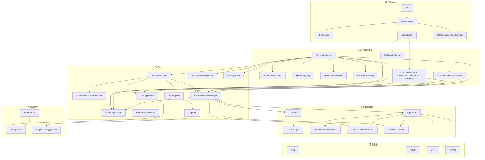
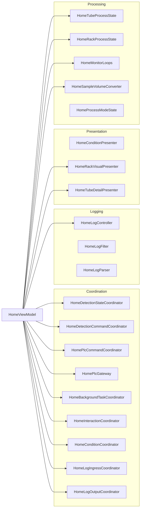
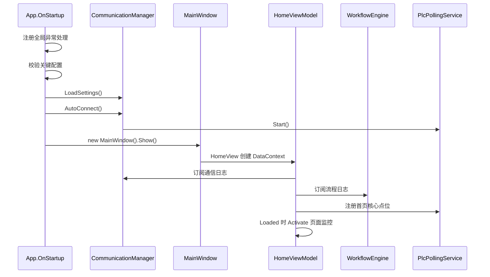
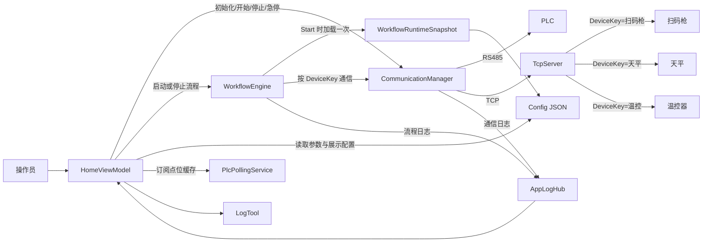
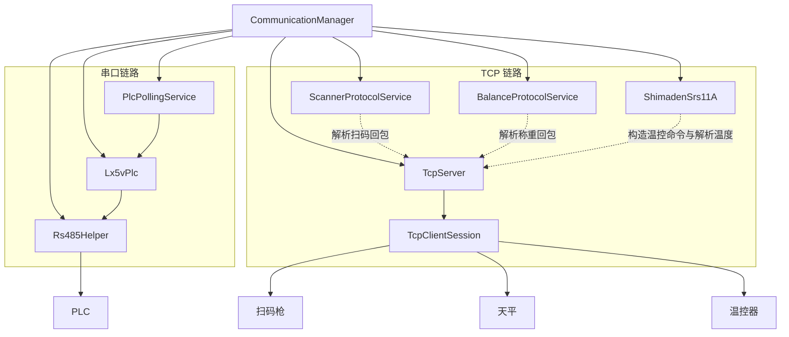
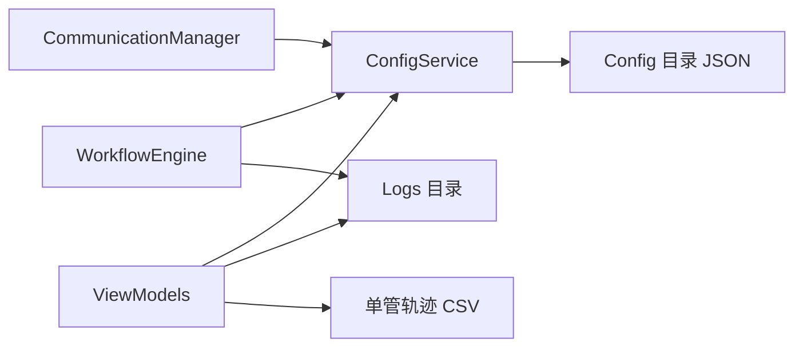
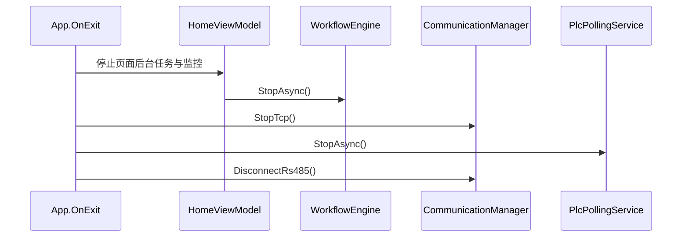

# Blood Alcohol 软件架构

## 1. 文档说明

本文档基于 2026-04-16 当前代码整理，重点反映本次调整后的实际结构，尤其是以下变化：

- `HomeViewModel` 已从“超大一体类”收敛为页面装配与状态协调入口
- 首页相关能力已拆分到 `ViewModels/Home/*` 分层目录
- TCP 设备识别已从“按远端端口”改为“按 DeviceKey 路由”
- `WorkflowEngine` 已改为按批次冻结运行时配置快照，不再运行中周期热加载
- 停机与退出语义已补齐，后台任务会按顺序等待退出

## 2. 总体分层图

## 3. 首页架构图

`HomeViewModel` 现在保留页面绑定、命令装配和各模块串联，不再直接承载所有细节逻辑。

### 3.1 首页分层目录

- `ViewModels/Home/HomeViewModel.cs`
  - 页面绑定入口
  - 命令装配
  - 模块协同
- `ViewModels/Home/Coordination/*`
  - 命令编排
  - 后台任务生命周期
  - 页面交互
  - 首页条件刷新
  - 日志入口与输出
- `ViewModels/Home/Logging/*`
  - 日志追加
  - 日志筛选
  - 日志解析
  - 日志计数
- `ViewModels/Home/Presentation/*`
  - 条件展示
  - 料架可视化
  - 采血管详情展示
- `ViewModels/Home/Processing/*`
  - 采血管流程上下文
  - 料架工序状态
  - 监控循环
  - 样本体积换算
  - 工艺模式状态
- `ViewModels/Home/Items/*`
  - `ConditionItemViewModel`
  - `HomeLogItemViewModel`
  - `RackSlotItemViewModel`

## 4. 启动与装配关系

### 4.1 启动特点

- `App.OnStartup`
  - 注册 UI 线程、Task、AppDomain 全局异常处理
  - 启动前校验关键配置
  - 调用 `CommunicationManager.LoadSettings()` 与 `CommunicationManager.AutoConnect()`
  - 创建主窗口
- `CommunicationManager`
  - 保留静态 facade
  - 内部已分出配置读写、自动连接和设备实例访问职责
  - 启动时统一装配 `Rs485Helper`、`Lx5vPlc`、`PlcPollingService`、`TcpServer`
- `HomeViewModel`
  - 构造时只完成依赖装配、命令创建和集合初始化
  - 页面可见时才启动监控
  - 页面不可见时停监控
  - 真正关闭窗口时再执行 `Dispose`

## 5. 运行期核心协作图

### 5.1 关键协作说明

- `HomeViewModel`
  - 负责把“页面动作”转成服务调用
  - 负责首页状态与展示同步
  - 不再直接堆放日志、监控、PLC 指令、料架解析等细节
- `WorkflowEngine`
  - 负责检测批次内的流程状态机
  - `Start()` 时加载 `WorkflowRuntimeSnapshot`
  - 运行中不再每 2 秒重新加载配置
  - 与扫码枪、天平、PLC 进行业务协作
- `CommunicationManager`
  - 统一提供 PLC、TCP、协议服务访问入口
  - 对外仍保留静态调用方式
  - 对内已收敛为较清晰的过渡结构
- `PlcPollingService`
  - 为首页与调试页提供高频点位缓存
  - `StopAsync()` 会等待轮询任务退出
- `AppLogHub`
  - 统一承接通信层和流程层日志，再交给首页或日志工具

## 6. 通信与设备关系图

### 6.1 通信层当前职责

- `TcpServer`
  - 按 `DeviceKey` 维护会话
  - 会话模型为 `TcpClientSession`
  - 支持 `SendToDeviceAsync`、`ReceiveOnceFromDeviceAsync`、`IsDeviceConnected`
  - 旧端口 API 仍保留兼容层，但已标记为过时
- `CommunicationSettings` 与 `TcpDeviceMapping`
  - 现在以 `DeviceKey + ClientIp + Port` 识别设备
  - 不再把远端源端口当成设备身份
- `ScannerProtocolService`
  - 负责扫码字符串清洗与结果校验
- `BalanceProtocolService`
  - 负责天平报文构造与严格帧校验
- `ShimadenSrs11A`
  - 负责温控命令和温度报文结构校验

## 7. 配置与持久化结构

### 7.1 当前主要配置对象

- `CommunicationSettings`
  - 串口参数
  - TCP 服务地址与端口
  - TCP 设备映射
- `ProcessParameterConfig`
  - 初始化参数与工艺参数
- `WorkflowSignalConfig`
  - 流程触发位、确认位、寄存器映射
- `WeightToZCalibrationConfig`
  - 重量转 Z 与体积换算标定
- `AxisDebugAddressConfig`
  - 轴调试地址映射
- `CoordinateDebugConfig`
  - 坐标调试参数
- `PointMonitorConfig`
  - 点位监控清单
- `FaultDebugConfig`
  - 故障定义与调试参数
- `HomeExportPathConfig`
  - 首页导出目录
- `HomeLogBatchCounterConfig`
  - 首页日志批次号

### 7.2 配置层特点

- 统一使用 `ConfigService<T>` 作为配置读写入口
- `ConfigFile<T>` 仅保留兼容包装层
- 关键配置模型已增加 `Validate()`
- 启动阶段会校验关键配置
- 配置非法时会记录日志，并阻止高风险流程启动

## 8. 停机与退出顺序

### 8.1 当前停机语义

- `WorkflowEngine.StopAsync()`
  - 取消 `_cts`
  - 等待 `_workerTask` 退出
  - 超时会记录日志，不会无限卡住
- `PlcPollingService.StopAsync()`
  - 取消轮询
  - 等待后台任务退出
- 监控型页面
  - 不可见时只停监控
  - 窗口关闭时再 `Dispose`
- `App.OnExit`
  - 已统一按“页面/流程 -> TCP -> PLC 轮询 -> 串口”顺序收口

## 9. 核心模块清单

| 模块 | 核心文件 | 当前作用 |
|---|---|---|
| 启动入口 | `App.xaml.cs` | 注册异常、校验配置、加载通信、创建主窗口 |
| 主窗口宿主 | `MainWindow.xaml` / `.cs` | 承载首页、通信页、调试页 |
| 首页装配入口 | `ViewModels/Home/HomeViewModel.cs` | 页面绑定、命令装配、模块协同 |
| 首页协同层 | `ViewModels/Home/Coordination/*` | 启停命令、日志入口、交互、后台任务管理 |
| 首页日志层 | `ViewModels/Home/Logging/*` | 日志追加、筛选、计数、解析 |
| 首页展示层 | `ViewModels/Home/Presentation/*` | 条件展示、料架可视化、详情展示 |
| 首页处理层 | `ViewModels/Home/Processing/*` | 采血管流程状态、料架状态、监控循环、体积换算 |
| 流程引擎 | `Services/WorkflowEngine.cs` | 冻结批次配置并驱动扫码、称重、写 PLC |
| 运行时快照 | `Services/WorkflowRuntimeSnapshot.cs` | 承载单批次固定配置 |
| 通信总入口 | `Services/CommunicationManager.cs` | 统一提供 PLC、TCP、协议和自动连接能力 |
| PLC 轮询 | `Services/PlcPollingService.cs` | 后台轮询点位并提供缓存 |
| TCP 服务端 | `Communication/Tcp/TcpServer.cs` | 按 DeviceKey 维护设备会话与收发 |
| 配置读写 | `Services/ConfigService.cs` | JSON 配置统一读写与校验入口 |
| 日志持久化 | `Logs/LogTool.cs` | `.log` 与轨迹 CSV 落盘 |
