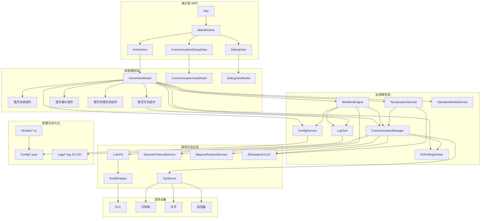
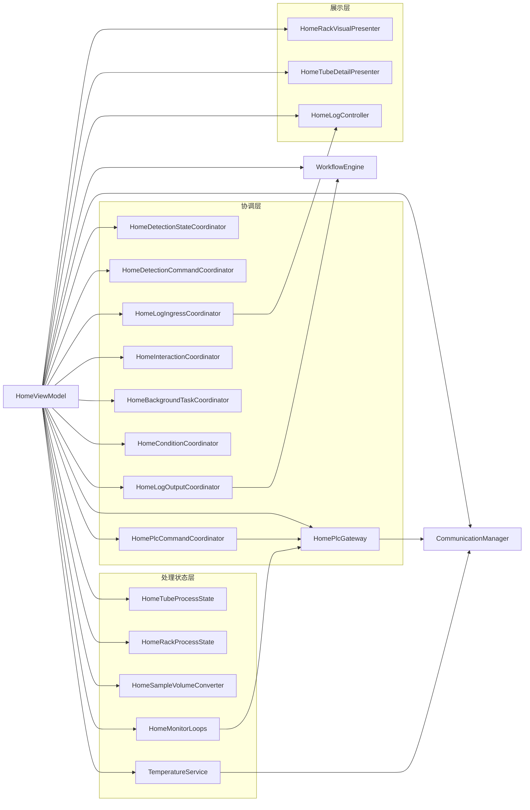
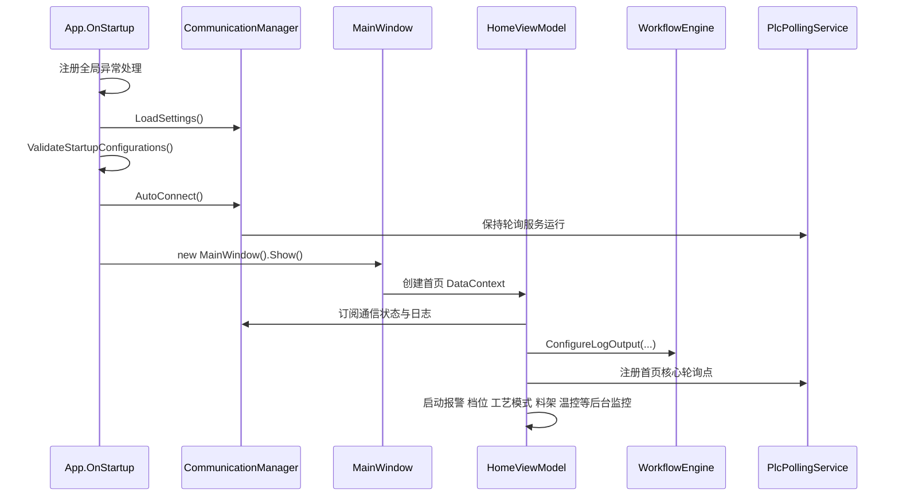
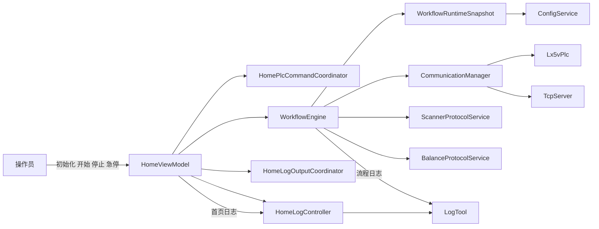
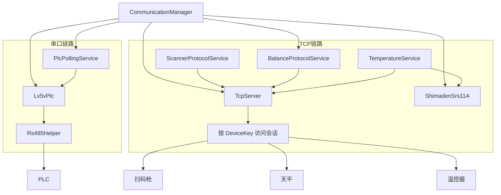

# Blood Alcohol 软件架构图

## 1. 文档说明

- 生成时间：2026-04-24
- 文档目的：说明当前上位机项目的分层结构、启动链路、运行期协作关系与现场设备连接方式
- 依据代码：
  - `App.xaml.cs`
  - `MainWindow.xaml`
  - `MainWindow.xaml.cs`
  - `ViewModels/Home/HomeViewModel.cs`
  - `Services/CommunicationManager.cs`
  - `Services/WorkflowEngine.cs`
  - `Services/TemperatureService.cs`
  - `Communication/Tcp/TcpServer.cs`

## 2. 总体分层架构图

## 3. 首页业务编排图

## 4. 启动时序图

## 5. 运行期协作图

## 6. 通信与设备拓扑图

## 7. 当前架构特点

- 前端采用 `WPF + MVVM`，主窗口以 `TabControl` 承载首页、通讯配置页、设置页。
- 首页 `HomeViewModel` 已拆分为协调、展示、日志、处理状态多个子组件，避免单类承担全部逻辑。
- `CommunicationManager` 作为静态总入口，集中管理 `RS485`、`PLC`、`TCP`、协议服务与通信配置。
- `WorkflowEngine` 负责检测流程状态机，启动时一次性加载 `WorkflowRuntimeSnapshot`，运行中不再频繁热加载配置。
- TCP 设备在接入层通过 `ClientIp + Port` 识别并绑定，在业务层统一通过 `DeviceKey` 访问。
- 首页在构造后立即启动报警、档位、工艺模式、料架、温控等后台监控任务，并在释放时按顺序停止。
- 日志分为首页可见日志与流程结构化日志，最终统一写入本地 `log` 与 `CSV` 文件。

## 8. 核心目录职责

| 目录或文件 | 职责 |
|---|---|
| `App.xaml.cs` | 应用启动、全局异常处理、启动配置校验、退出时统一收口 |
| `MainWindow.xaml` | 主窗口与首页/通讯配置/设置页宿主 |
| `Views/` | 各页面与调试视图 |
| `ViewModels/Home/` | 首页业务编排、日志处理、状态展示与后台监控 |
| `Services/` | 流程引擎、通信总入口、轮询服务、温控服务、配置读写 |
| `Communication/Serial/` | PLC 串口通信与底层传输 |
| `Communication/Tcp/` | TCP 服务端、会话路由、按设备键收发数据 |
| `Protocols/` | 扫码枪、天平、温控器协议封装 |
| `Models/` | 配置模型、业务模型、映射定义 |
| `Config/` | JSON 配置文件 |
| `Logs/` | 运行日志与轨迹导出文件 |

## 9. 建议阅读顺序

1. `App.xaml.cs`
2. `MainWindow.xaml`
3. `ViewModels/Home/HomeViewModel.cs`
4. `Services/CommunicationManager.cs`
5. `Services/WorkflowEngine.cs`
6. `Services/TemperatureService.cs`
7. `Communication/Tcp/TcpServer.cs`
