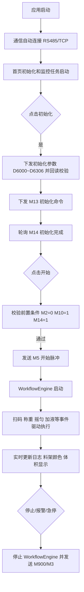

# Blood Alcohol 运行逻辑说明

## 1. 文档目的

本文档基于当前项目代码，说明上位机从启动到检测执行、再到停止/异常处理的实际运行逻辑，便于调试联机与工艺联调。

## 2. 系统启动逻辑

### 2.1 应用启动入口

- 入口：`App.OnStartup`
- 关键动作：
1. 注册全局异常处理（UI线程异常、未观察任务异常、域异常）
2. 订阅通信日志事件 `CommunicationManager.OnLogReceived`
3. 加载通信配置 `CommunicationManager.LoadSettings()`
4. 自动连接设备 `CommunicationManager.AutoConnect()`
5. 打开主窗口 `MainWindow`

### 2.2 通信层启动

- `CommunicationManager` 在静态构造中完成：
1. 注册 RS485 日志回调
2. 启动 `PlcPollingService`
- `AutoConnect()` 会尝试：
1. 打开 RS485 串口并创建 PLC 会话
2. 启动 TCP 服务端（供扫码枪、天平、温控器等客户端连接）

### 2.3 首页 ViewModel 初始化

- `HomeViewModel` 构造时完成：
1. 创建并绑定所有命令（初始化、开始、停止、急停、模式切换等）
2. 初始化料架槽位集合、条件项、默认日志
3. 注册首页核心 PLC 轮询点位（报警位、工艺模式位）
4. 订阅通信日志与流程引擎日志
5. 启动后台监控任务：
   - 报警监控
   - 工艺模式监控
   - 料架工序寄存器监控

## 3. 运行主流程

## 4. 初始化逻辑

### 4.1 初始化触发

- 命令：`InitCommand`
- 入口：`InitializeSystemAsync`

### 4.2 初始化参数下发

- 方法：`SendInitParametersToPlcWithVerifyAsync`
- 行为：
1. 从 `ProcessParameterConfig.json` 读取参数
2. 写入 PLC 寄存器（含 D6000、D6020~D6031、D6040~D6042、D6302、D6304、D6306）
3. 每项写入后立即回读校验，确保写入一致

### 4.3 初始化完成判断

- 下发初始化命令位：`M13=1`
- 轮询完成位：`M14`
- 超时时间：10 分钟
- 成功条件：检测到初始化完成位为真（支持首次即为高电平场景）

## 5. 开始检测逻辑

### 5.1 开始前置条件

- 方法：`TrySendStartPulseByPreconditionsAsync`
- 必须满足：
1. 报警位 `M2=0`
2. 自动模式位 `M10=1`
3. 初始化完成位 `M14=1`

任一不满足则强制写 `M5=0` 并记录原因日志。

### 5.2 开始动作

- 发送 `M5` 开始脉冲（高 1 秒后拉低）
- 标记检测启动状态
- 启动 `WorkflowEngine`
- 启动采血管数量同步任务（周期写入 `D230`）

## 6. WorkflowEngine 事件驱动逻辑

### 6.1 运行机制

- `WorkflowEngine.Start()` 启动后台循环 `MonitorEventsLoopAsync`
- 周期动作：
1. 刷新运行配置（流程信号、工艺参数、重量标定）
2. 轮询触发位上升沿并分发处理器
3. 轮询摇匀时长寄存器并输出进度日志

### 6.2 关键步骤映射

| 步骤号 | 逻辑 |
|---|---|
| 3 | 扫码成功，建立当前采血管序号与条码映射 |
| 4 | 等待扫码确认位 |
| 5 | 天平清零 |
| 6 | 下发摇匀时长寄存器 |
| 7~9 | 采血管/顶空瓶摇匀进度监控日志 |
| 10~13 | 顶空瓶放置称重及确认 |
| 14~19 | 采血管称重与两次重量转 Z（含 Z 下发） |
| 20~27 | 顶空瓶加血液/加叔丁醇后称重及确认 |

### 6.3 重量转 Z 与体积显示

- `WorkflowEngine` 读取天平重量后：
1. 对采血管关键步骤执行重量->Z 换算并写入 Z 目标寄存器
2. 通过日志事件回传 `MeasuredWeight` 与 `WeightStepKey`
- `HomeViewModel` 监听流程日志：
1. 读取 `WeightToZCalibrationConfig.json` 中 `MicroliterPerWeight`
2. 在“采血管放置”与“采血管吸液后”两类步骤实时刷新 `SampleVolume`（微升显示）

## 7. 页面联动与可视化状态

### 7.1 料架颜色刷新

- 监控来源：`D233~D254`（22 个寄存器）
- 刷新周期：300ms
- 颜色规则：
1. 已选中：蓝色（待执行）
2. 未选中：白色
3. 运行中：紫色
4. 完成：绿色

### 7.2 数量联动

- 用户选择采血管数量后：
1. 采血管数量范围 0~50
2. 顶空瓶数量自动映射为 `采血管 * 2`，上限 100
- 检测进行中禁止减少数量，仅允许增加

### 7.3 工艺模式显示

- 监控位：`M490~M493`
- 模式优先级：进样 > 排气 > 加压 > 待机
- UI 实时更新当前模式文本与状态灯

## 8. 停止与异常处理

### 8.1 正常停止

- `StopDetection()`：
1. 停止检测状态
2. 停止数量同步与流程引擎
3. 清理料架工序状态
4. 发送 `M900` 停止脉冲

### 8.2 急停

- `EmergencyStop()`：
1. 立即停止流程引擎
2. 发送 `M3` 急停脉冲
3. 再发送 `M900` 停止脉冲

### 8.3 报警自动停机

- 报警监控读取 `M2`
- 若检测中触发 `M2=1`：
1. 自动执行停机逻辑
2. 写入报警停机日志
3. 更新页面提示为“先排查报警后复位”

### 8.4 通信异常防护

- 全局异常会识别 PLC 通信类异常并弹出告警
- `PlcPollingService` 缓存轮询结果，降低串口压力
- 通信断开时监控任务进入降级逻辑，避免使用旧状态误导界面

## 9. 配置与持久化

### 9.1 参数配置页

- `ParameterConfigViewModel` 负责：
1. 从 `ProcessParameterConfig.json` 读取参数
2. 修改并保存参数到 JSON
3. 恢复默认值（仅更新界面，需手动保存）

### 9.2 配置生效时机

- 参数保存后先落盘
- 在下一次“初始化”流程时由 `HomeViewModel` 统一下发到 PLC 并校验
- `WorkflowEngine` 运行中会周期重载流程信号与标定配置，保证联调期间可热更新

## 10. 释放逻辑

页面销毁时 `HomeViewModel.Dispose()` 会统一执行：

1. 注销事件订阅
2. 停止所有后台任务
3. 注销首页轮询点位
4. 防止页面关闭后持续占用通信资源
