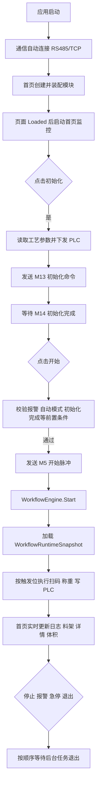

# BloodAlcohol 运行流程图

## 1. 文档目的

本文档用于说明当前版本上位机从启动、初始化、开始检测，到停止、急停、退出的实际运行路径。内容已同步到本次重构后的代码结构，重点体现：

- 首页监控页面按可见性激活与停用
- `WorkflowEngine` 按批次冻结运行时配置
- TCP 设备按 `DeviceKey` 路由
- 停机与退出会等待后台任务收口

## 2. 系统启动逻辑

### 2.1 应用启动入口

- 入口：`App.OnStartup`
- 关键动作：
1. 注册全局异常处理
2. 校验关键配置
3. 订阅通信日志
4. 加载通信配置 `CommunicationManager.LoadSettings()`
5. 自动连接设备 `CommunicationManager.AutoConnect()`
6. 打开主窗口 `MainWindow`

### 2.2 通信层启动

- `CommunicationManager` 在静态装配阶段完成：
1. 注册 RS485 日志回调
2. 创建 PLC 访问对象
3. 创建 `PlcPollingService`
4. 创建 `TcpServer`
- `AutoConnect()` 会尝试：
1. 打开 RS485 串口并连接 PLC
2. 启动 TCP 服务端
3. 让扫码枪、天平、温控器按 `DeviceKey` 建立识别关系

### 2.3 首页 ViewModel 初始化

- `HomeViewModel` 构造时完成：
1. 创建并绑定命令
2. 初始化料架、条件项、日志集合
3. 装配首页协调器、展示器和处理器
4. 订阅通信日志与流程日志
5. 注册首页核心 PLC 轮询点位
- 首页真正显示后才会启动后台监控：
1. 报警监控
2. 工艺模式监控
3. 料架工序监控
4. 采血管事件循环

## 3. 运行主流程

## 4. 初始化逻辑

### 4.1 初始化触发

- 命令：`InitCommand`
- 页面入口：`HomeViewModel.InitializeSystemAsync`
- 具体编排：`HomeDetectionCommandCoordinator` + `HomePlcCommandCoordinator`

### 4.2 初始化参数下发

- 读取：`ProcessParameterConfig.json`
- 下发方式：
1. 写入 PLC 目标寄存器
2. 每项回读校验
3. 写入不一致时记录失败日志并终止初始化

### 4.3 初始化完成判断

- 下发初始化位：`M13=1`
- 完成判断位：`M14`
- 超时：10 分钟
- 特点：
1. 支持首次检测时完成位已为高电平
2. 超时会写日志，不会无限等待

## 5. 开始检测逻辑

### 5.1 开始前置条件

- 方法入口：`HomeViewModel.StartDetectionAsync`
- 前置条件至少包括：
1. 报警位 `M2=0`
2. 自动模式位 `M10=1`
3. 初始化完成位 `M14=1`

任一条件不满足时，不会启动流程，并会写明原因日志。

### 5.2 开始动作

1. 发送 `M5` 开始脉冲
2. 标记首页检测状态
3. 启动 `WorkflowEngine`
4. 启动采血管数量同步任务

## 6. WorkflowEngine 事件驱动逻辑

### 6.1 运行机制

- `WorkflowEngine.Start()` 执行时：
1. 读取 `WorkflowSignalConfig`
2. 读取 `ProcessParameterConfig`
3. 读取 `WeightToZCalibrationConfig`
4. 组装 `WorkflowRuntimeSnapshot`
5. 校验快照后启动后台循环

### 6.2 当前运行特点

- 一个检测批次内使用同一份配置快照
- 运行中不再每 2 秒重新加载配置
- 如果配置变更，需要在下一批 `Start()` 时生效

### 6.3 设备协作方式

- 扫码枪：
  - 通过 `CommunicationManager.GetDeviceKey("扫码枪")`
  - 再由 `TcpServer.SendToDeviceAsync / ReceiveOnceFromDeviceAsync` 通信
- 天平：
  - 同样通过 `DeviceKey=天平` 访问
- PLC：
  - 继续通过 RS485 + `Lx5vPlc` 完成读写

### 6.4 关键步骤映射

| 步骤号 | 逻辑 |
|---|---|
| 3 | 扫码成功并建立当前采血管与条码映射 |
| 4 | 等待扫码确认位 |
| 5 | 天平清零 |
| 6 | 下发摇匀时长寄存器 |
| 7~9 | 摇匀进度监控日志 |
| 10~13 | 顶空瓶放置称重及确认 |
| 14~19 | 采血管称重与重量转 Z |
| 20~27 | 顶空瓶加液后称重及确认 |

## 7. 页面联动与可视化状态

### 7.1 料架颜色刷新

- 数据来源：`D233~D254`
- 刷新周期：300ms
- 颜色规则：
1. 已选中：蓝色
2. 未选中：白色
3. 运行中：紫色
4. 完成：绿色

### 7.2 数量联动

- 用户设置采血管数量后：
1. 采血管数量范围 0~50
2. 顶空瓶数量自动映射为 `采血管 * 2`
3. 检测进行中禁止减少数量，仅允许增加

### 7.3 工艺模式显示

- 监控位：`M490~M493`
- 模式优先级：进样 > 排气 > 加压 > 待机
- 首页实时刷新当前模式文本和状态灯

### 7.4 单管详情刷新

- `HomeTubeProcessState` 负责维护采血管上下文
- `HomeTubeDetailPresenter` 负责把上下文映射到右侧详情区
- 重量转体积显示由 `HomeSampleVolumeConverter` 负责

## 8. 日志与轨迹输出

### 8.1 首页日志

- `HomeLogIngressCoordinator`
  - 负责接入通信日志和流程日志
- `HomeLogController`
  - 负责追加、筛选、计数和导出记录构造
- `HomeLogOutputCoordinator`
  - 负责导出目录、批次号和轨迹 CSV

### 8.2 日志输出路径

- 首页普通日志：`.log`
- 单管轨迹：按批次号拆分 CSV

## 9. 停止与异常处理

### 9.1 正常停止

- 页面入口：`HomeViewModel.StopDetectionAsync`
- 主要动作：
1. 停止首页检测状态
2. 停止数量同步任务
3. 调用 `WorkflowEngine.StopAsync()`
4. 发送 `M900` 停止脉冲
5. 清理运行态料架状态

### 9.2 急停

- 页面入口：`HomeViewModel.EmergencyStopAsync`
- 主要动作：
1. 先停 `WorkflowEngine`
2. 发送 `M3` 急停脉冲
3. 再发送 `M900` 停止脉冲

### 9.3 报警自动停机

- 报警监控读取 `M2`
- 若检测中出现 `M2=1`：
1. 自动进入停机逻辑
2. 写入报警停机日志
3. 更新首页提示

### 9.4 通信异常防护

- 配置非法时，启动阶段直接阻断高风险流程
- PLC 通信异常会通过全局异常处理与日志提示
- TCP 设备未识别时会明确记录错误，不再静默吞掉
- 坏帧校验失败时由协议层拒绝进入业务流程

## 10. 页面生命周期与退出逻辑

### 10.1 监控型页面生命周期

- 构造时不自动启动监控
- `Loaded` 时调用 `ActivateMonitoring()`
- `Unloaded` 时调用 `DeactivateMonitoring()`
- 宿主窗口真正关闭时再 `Dispose()`

### 10.2 应用退出顺序

1. 先停页面监控和首页后台任务
2. 再停 `WorkflowEngine`
3. 再停 `CommunicationManager.StopTcp()`
4. 再停 `PlcPollingService.StopAsync()`
5. 最后断开 `CommunicationManager.DisconnectRs485()`

### 10.3 退出语义

- 所有 `StopAsync()` 都带超时等待
- 超时只记录日志，不会无限卡死
- 退出时统一使用异步等待，避免 UI 线程死锁
