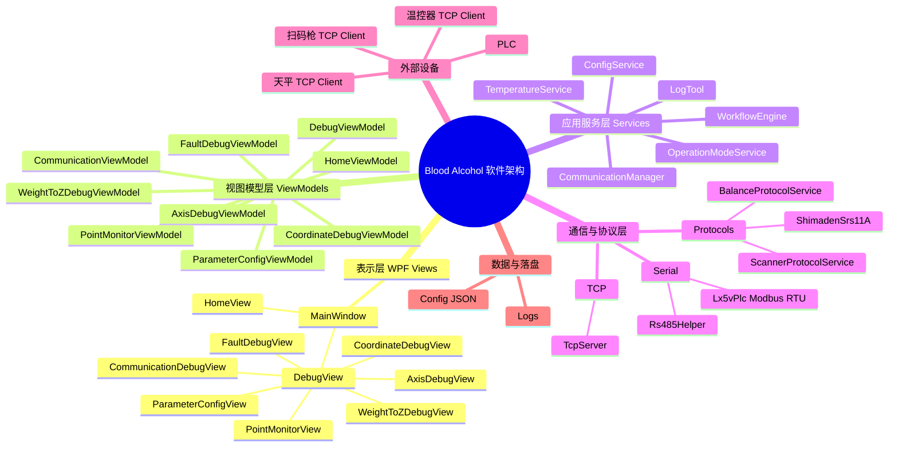

# Blood Alcohol 软件架构图

```mermaid
mindmap
  root((Blood Alcohol 软件架构))
    表示层 WPF Views
      MainWindow
        HomeView
        DebugView
          CommunicationDebugView
          AxisDebugView
          PointMonitorView
          FaultDebugView
          CoordinateDebugView
          WeightToZDebugView
          ParameterConfigView
    视图模型层 ViewModels
      HomeViewModel
      DebugViewModel
      CommunicationViewModel
      AxisDebugViewModel
      PointMonitorViewModel
      FaultDebugViewModel
      CoordinateDebugViewModel
      WeightToZDebugViewModel
      ParameterConfigViewModel
    应用服务层 Services
      OperationModeService
      WorkflowEngine
      CommunicationManager
      TemperatureService
      ConfigService
      LogTool
    通信与协议层
      Serial
        Rs485Helper
        Lx5vPlc Modbus RTU
      TCP
        TcpServer
      Protocols
        ScannerProtocolService
        BalanceProtocolService
        ShimadenSrs11A
    外部设备
      PLC
      扫码枪 TCP Client
      天平 TCP Client
      温控器 TCP Client
    数据与落盘
      Config JSON
      Logs
```
